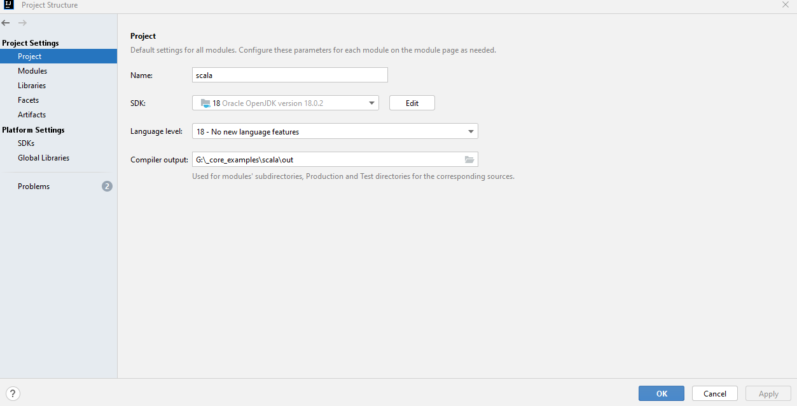
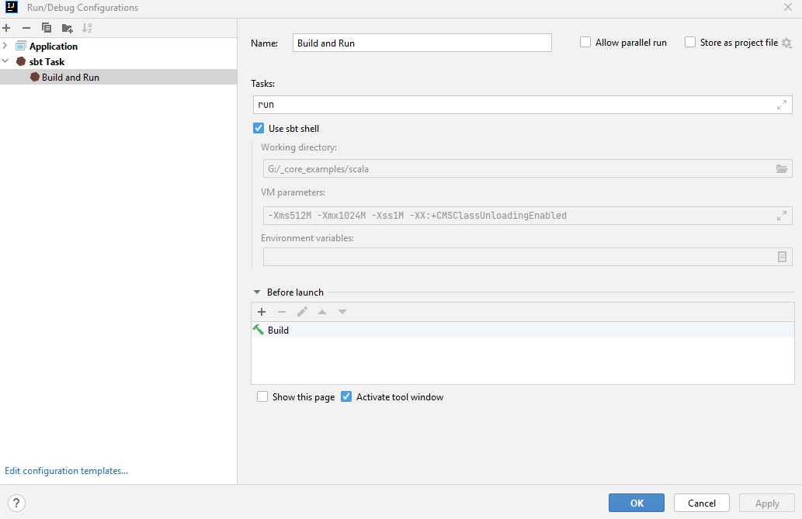

# Scala Review and Refresh

Scala review and refresh.

## Setup and Use

I found the easiest way to get Scala set up on Windows 11 is to:

1. Install the [Scala Plugin](https://plugins.jetbrains.com/plugin/1347-scala) through IntelliJ.
2. Make sure to set **Project Structure** > **Platform Settings** > **Global Libraries** to: `scala-sdk-2.13.10`.

   

3. Make sure to set **Project Structure** > **Project Settings** > **Project** > **SDK** to: Java `18`.

    

## sbt

To compile build and run Scala files/apps:

1. Open **Run** > **Edit Configurations** > **sbt Task**

   

2. Assuming a valid `build.sbt` configuration file and a main method (`@main`) exists within the `src/main/scala` classpath, a **Build** command will be automatically added to the defined task.
3. Add `run` to **Tasks**.
4. Then run the named task.

## Resources

1. https://docs.scala-lang.org/scala3/book/methods-main-methods.html
2. https://docs.scala-lang.org/getting-started/intellij-track/getting-started-with-scala-in-intellij.html
3. https://www.tutorialspoint.com/scala
4. https://www.baeldung.com/scala/scala-3-main-methods
5. https://docs.scala-lang.org/tour/tour-of-scala.html
6. https://stackoverflow.com/questions/1791408/what-is-the-difference-between-a-var-and-val-definition-in-scala